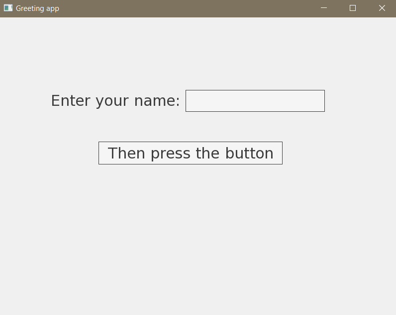
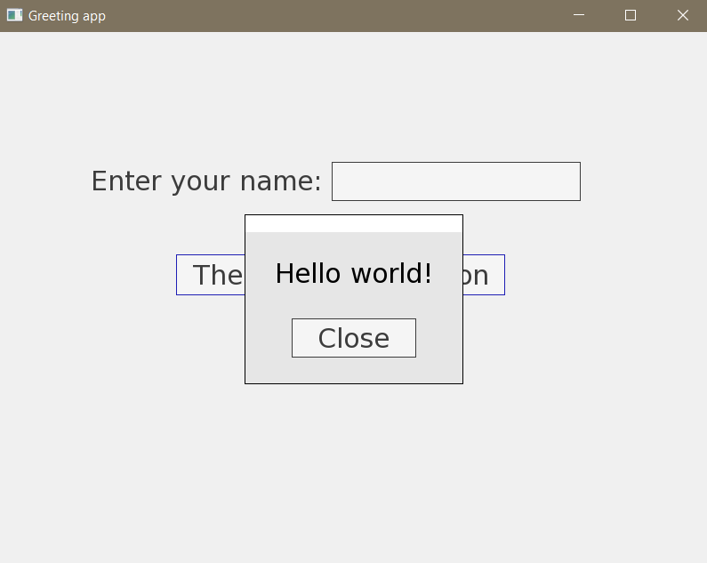
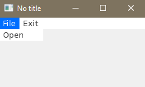

White Gold 
===

Ruby gem for building pure ruby graphical user interface.<br>
Uses [TGUI](https://tgui.eu/) & [SFML](https://www.sfml-dev.org/) as a backend.<br>
Dedicated to creating single-file applications and learning programming.

Taste
---

```RUBY
require 'white_gold'

title! "Greeting app"
text_size! 30

label! text: "Enter your name:", position: [100, 150], size: [340, 44]
editbox! :name, position: [375, 146], size: [280, 44]
button! text: "Then press the button", position: [200, 250] do
  on_press! do
    text = page[:name].text
    text = "world" if text.strip.empty?
    messagebox! text: "Hello #{text}!", position: :center do
      button! text: "Close", on_press: proc{ window.close }
    end
  end
end
```
### Output:<br>
   


Check out [sample](https://github.com/lpogic/white_gold/tree/master/sample) for more.

Requirements
---
- Ruby >= 3.2.2
- Fiddle >= 1.1.1

Installation
---
1) From source
```
git clone https://github.com/lpogic/white_gold
gem build ./white_gold/white_gold.gemspec
gem install white_gold-0.0.1.gem
```
2) From official
```
gem install white_gold
```

Basic usage
---
```RUBY
require 'white_gold'

button! text: "Exit", position: :center, on_press: proc.exit

def exit
  window.close
end
```

Advanced usage
---
```RUBY
require 'white_gold/master'

class FirstPage < Page
  def build
    button! text: "Second Page", position: :center, on_press: proc{ go SecondPage }
  end

end

class SecondPage < Page
  def build
    button! text: "Exit", position: :center, on_press: proc.exit
  end

  def exit
    window.close
  end
end

WhiteGold.new.run FirstPage
```

DSL
---

### Abstract bang stack:<br>

Allows to simulate local block call context. Convenient and flexible way for building tree like structures.

```RUBY
require 'white_gold'

menu! do # root bang call stack is [Page], so method 'menu!' is delegated to Page object
  item! "File" do # bang call stack is [Page, MenuBar]; MenuBar responds to 'item!', so method call is delegated to it.
    item! "Open" # bang call stack: [Page, MenuBar, MenuItem("File")]; 'item!' goes to MenuItem("File")
  end
  item! "Exit" # bang call stack: [Page, MenuBar]; 'item!' goes to MenuBar
end
```

### Output:<br>


The abstract bang stack is based on method_missing mechanism, so lexical scope is not overwritten. 'self' left unchanged. 
Instance methods and variables are available directly:

```RUBY
require 'white_gold'

def foo
  "foo"
end

@bar = "bar"

menu! do
  item! "File" do
    item! "Open"
    puts foo # prints "foo"
    puts @bar # prints "bar"
  end
  item! "Exit"
end
```

Defining methods witch '!' at the end should be avoided, because its breaks method_missing redirecting.
To define new bang callable method, use 'def!':

```RUBY
require 'white_gold'

class MenuBar::MenuItem
  def! :open_item do # until now "Open" MenuItem can be created in any other MenuItem 
    item! "Open"
  end
end

menu! do
  item! "File" do
    open_item!
  end
  item! "Exit" do
    open_item!
  end
end
```

When top bang call stack target doesn't respond to bang method, then method is redirected to the target below.

```RUBY
require 'white_gold'

button! text: "Show message" do
  on_press! do # note: abstract bang stack is overwritten before callback block call, but for this example it is the same: [Page, Button]
    messagebox! text: "Hello" # Button doesn't respond to 'messagebox!' but Page does. Page receives the call.
  end
end
```

For convenience also setters are callable in bang form:

```RUBY
require 'white_gold'

button! do
  # Button has defined 'text=' method, which can be called in two ways:
  self!.text = "Hello" # note: self! returns bang stack top object
  text! "Hello"
end
```

### Widgets attributing:<br>

Almost every widget is created empty. Attribute setting is invoked on existing instance:

```RUBY
require 'white_gold'

button = button!
button.text = "Button"
button.position = [50, 50]
button.on_press = proc do
  puts "Have I been pressed?"
end
```

There are two other ways for setting attributes. First one uses bang calls (described in details in previous paragraph):

```RUBY
require 'white_gold'

button! do
  text! "Button"
  position! 50, 50 # implicit multiple arguments to array conversion
  on_press! do # implicit block to proc conversion
    puts "Have I been pressed?"
  end
end
```

Second one is passing attributes as named arguments:

```RUBY
require 'white_gold'

button! text: "Button", position: [50, 50], on_press: proc{ puts "Have I been pressed?" }
```

With the help of the 'upon!' method, these methods can also be used after initialization:

```RUBY
require 'white_gold'

button = button!
upon! button, text: "Button", position: [50, 50] do # note: 'upon!' puts first argument on top of the bang stack
  on_press! do
    puts "Have I been pressed?"
  end
end
```

### Method to proc conversion:<br>

To convert method to proc, prefix it with 'proc.':

```RUBY
require 'white_gold'

def foo btn
  btn.text = "foo"
end

button! text: "bar", on_press: proc.foo
```

```RUBY
require 'white_gold'

button! text: "Exit", position: :center, on_press: window.proc.close
```


Status
---
A hobby project developed by one person.

Contact
---
name: Łukasz Pomietło<br>
email: oficjalnyadreslukasza@gmail.com
