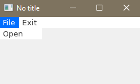

**This is the draft version of the white_gold wiki home page.**<br><br>

Welcome to the _white_gold_ wiki!
===

Basics
---

### 0. No title
Simplest application written in white_gold:
#[sample/first_steps/step_0.rb]
When library is loaded this way, window is shown on script end.

### 1. Hello world
Let's customize window title:
#[sample/first_steps/step_1.rb]
Methods with trailing '!' are quiet common in white_gold. Generally, they are used to change the state of the currently running object.

### 2. Button
Widgets are also created by methods with bang:
#[sample/first_steps/step_2.rb]
Several named arguments can be passed with the widget creating method call. They will be used as the new widget attributes.

### 3. Widget tree
To build widget tree, call widget creating methods inside associated block:
#[sample/first_steps/step_3.rb]
Providing an array as position attribute allows to set x and y coordinates individually. 
When rational is used as position argument, then it is interpreted as relative to the parent size.

### 4. Callbacks
In associated blocks attributes can be adapted, too:
#[sample/first_steps/step_4.rb]
`on_press!` can be called multiple times, every time new signal listener is attached. The block given as the argument is evaluated when the button is pressed.

### 5. Themes
Theme defines how widgets looks like. `theme!` method allows to set up global theme for all widgets. There is also `renderer!` method to make widget special look:
#[sample/first_steps/step_5.rb]

### 6. Custom widgets
List of base widgets with methods to create them can be found [here](./api). 
Custom widgets can be created by customizing and combining base widgets:
#[sample/first_steps/step_6.rb]
Notice, that methods are not defined in common way (`def! :hello_world` instead of `def hello_world!`).

DSL
---

### Abstract bang stack:<br>

Allows to simulate local block call context. Convenient and flexible way for building tree like structures.

```RUBY
require 'white_gold'

menu! do # root bang call stack is [Page], so method 'menu!' is delegated to Page object
  item! "File" do # bang call stack is [Page, MenuBar]; MenuBar responds to 'item!', so method call is delegated to it.
    item! "Open" # bang call stack: [Page, MenuBar, MenuItem("File")]; 'item!' goes to MenuItem("File")
  end
  item! "Exit" # bang call stack: [Page, MenuBar]; 'item!' goes to MenuBar
end
```

Output:<br>


The abstract bang stack is based on method_missing mechanism, so lexical scope is not overwritten. 'self' left unchanged. 
Instance methods and variables are available directly:

```RUBY
require 'white_gold'

def foo
  "foo"
end

@bar = "bar"

menu! do
  item! "File" do
    item! "Open"
    puts foo # prints "foo"
    puts @bar # prints "bar"
  end
  item! "Exit"
end
```

Defining methods witch '!' at the end should be avoided, because its breaks method_missing redirecting.
To define new bang callable method, use 'def!':

```RUBY
require 'white_gold'

class MenuBar::MenuItem
  def! :open_item do # until now "Open" MenuItem can be created in any other MenuItem 
    item! "Open"
  end
end

menu! do
  item! "File" do
    open_item!
  end
  item! "Exit" do
    open_item!
  end
end
```

When top bang call stack target doesn't respond to bang method, then method is redirected to the target below.

```RUBY
require 'white_gold'

button! text: "Show message" do
  on_press! do # note: abstract bang stack is overwritten before callback block call, but for this example it is the same: [Page, Button]
    messagebox! text: "Hello" # Button doesn't respond to 'messagebox!' but Page does. Page receives the call.
  end
end
```

For convenience also setters are callable in bang form:

```RUBY
require 'white_gold'

button! do
  # Button has defined 'text=' method, which can be called in two ways:
  self!.text = "Hello" # note: self! returns bang stack top object
  text! "Hello"
end
```

### Widgets attributing:<br>

Almost every widget is created empty. Attribute setting is invoked on existing instance:

```RUBY
require 'white_gold'

button = button!
button.text = "Button"
button.position = [50, 50]
button.on_press = proc do
  puts "Have I been pressed?"
end
```

There are two other ways for setting attributes. First one uses bang calls (described in details in previous paragraph):

```RUBY
require 'white_gold'

button! do
  text! "Button"
  position! 50, 50 # implicit multiple arguments to array conversion
  on_press! do # implicit block to proc conversion
    puts "Have I been pressed?"
  end
end
```

Second one is passing attributes as named arguments:

```RUBY
require 'white_gold'

button! text: "Button", position: [50, 50], on_press: proc{ puts "Have I been pressed?" }
```

With the help of the 'upon!' method, these methods can also be used after initialization:

```RUBY
require 'white_gold'

button = button!
upon! button, text: "Button", position: [50, 50] do # note: 'upon!' puts first argument on top of the bang stack
  on_press! do
    puts "Have I been pressed?"
  end
end
```

### Method to proc conversion:<br>

To convert method to proc, prefix it with 'proc.':

```RUBY
require 'white_gold'

def foo btn
  btn.text = "foo"
end

button! text: "bar", on_press: proc.foo
```

```RUBY
require 'white_gold'

button! text: "Exit", position: :center, on_press: window.proc.close
```

API
---
_Due to the heavy use of metaprogramming, the documentation generated by tools like rdoc can be confusing._

Methods prefixed with `api_`, `abi_`, `self_`, `_abi_` belongs to the internal API and shouldn't be used directly.<br>
Generated API reference: [Widgets API](./api)
